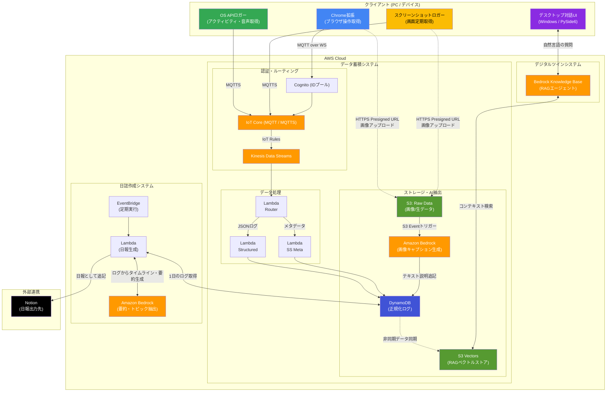

# ShadowSync

ハッカソンテーマ「人をダメにするサービス」に対する、個人活動ログ自動集計・活用システムのAI-DLC Inception成果物です。

ShadowSyncは、PC上の行動、ブラウザ閲覧、スクリーンショットを自動収集し、日報作成や自分のデジタルツインとの対話に使える形へ整理するサービスです。人が「何をしていたか」を思い出し、記録し、振り返り、報告する作業をできるだけ手放せる状態を目指します。

## コア・コンセプト：意識の裏側で同期し、活動し続ける「影」
ShadowSyncの目標は、単なるロギングツールではありません。ユーザーの行動を克明に記録し、常にユーザーの影（Shadow）となって、背後で「同時に活動し続ける存在」を構築することにあります。

「今」に集中し、記録することすら忘れて自堕落になれる贅沢。それを実現するために、あなたの「影」がすべての文脈を拾い上げ、未来のあなたのために経験を血肉化し続けます。光（意識的な活動）があるところには必ず影（ShadowSync）があり、あなたが何もしなくても、あなたの活動の裏側で「もう一人のあなた」が自律的に動き続けます。

## システム全体構成アーキテクチャ

ShadowSyncは、大きく分けて4つのサブシステム（ユニット）で構成されています。
クライアントデバイス（ロガー）が取得した生データは、AWS上のデータ蓄積システムで意味のあるコンテキストに変換され、日報の自動作成やデジタルツインでの対話に活用されます。



## 提出用資料

- [Inceptionフェーズ終了レポート](aidlc-docs/inception-completion-report.md)
- [親AI-DLC 状態管理](aidlc-docs/aidlc-state.md)
- [子AI-DLC 進捗管理](aidlc-docs/sub-aidlc-progress.md)
- [Construction設計QAバックログ](aidlc-docs/construction-design-qa-backlog.md)
- [Constructionで行うこと](aidlc-docs/construction-readiness-issues.md)

## ドキュメント構成

| 領域              | 内容                                                      | 主なリンク                                                                                                                                                                                                                                                             |
| ----------------- | --------------------------------------------------------- | ---------------------------------------------------------------------------------------------------------------------------------------------------------------------------------------------------------------------------------------------------------------------- |
| 親AI-DLC          | 全体Intent、ユニット分解、子AI-DLCへの委譲設計            | [親Inception](aidlc-docs/inception/requirements/requirements.md), [Unit定義](aidlc-docs/inception/application-design/unit-of-work.md), [依存関係](aidlc-docs/inception/application-design/unit-of-work-dependency.md)                                                  |
| Logger            | OS、Chrome、スクリーンショットの活動ログ取得              | [osapi](logger/osapi/aidlc-docs/inception/requirements/requirements.md), [chrome-extension](logger/chrome-extension/aidlc-docs/inception/requirements/requirements.md), [ss-tool](logger/ss-tool/aidlc-docs/inception/requirements/requirements.md)                    |
| Data Accumulation | IoT Core、Lambda、DynamoDB、S3、Bedrockによる蓄積・正規化 | [requirements](data-accumulation/aidlc-docs/inception/requirements/requirements.md), [unit-of-work](data-accumulation/aidlc-docs/inception/application-design/unit-of-work.md)                                                                                         |
| Daily Log         | 正規化済み活動データからの日報生成とNotion連携            | [requirements](daily-log/aidlc-docs/inception/requirements/requirements.md), [application-design](daily-log/aidlc-docs/inception/application-design/application-design.md)                                                                                             |
| Digital Twin      | 過去活動に対するRAG検索と対話UI                           | [requirements](digital-twin/aidlc-docs/inception/requirements/requirements.md), [application-design](digital-twin/aidlc-docs/inception/application-design/application-design.md), [unit-of-work](digital-twin/aidlc-docs/inception/application-design/unit-of-work.md) |

## AI-DLC構成

```text
ShadowSync (親AI-DLC)
├── logger/
│   ├── osapi/
│   ├── chrome-extension/
│   └── ss-tool/
├── data-accumulation/
├── daily-log/
└── digital-twin/
```

親AI-DLCはコード実装を担当せず、全体Intent、ユニット分解、子AI-DLCへの委譲、親子間のインターフェース整合を担当します。各子AI-DLCは独立したInception成果物を持ち、Constructionフェーズで個別に実装へ進める構成です。

この構成は、複数人・複数AIによる並列開発と、将来的な拡張性を前提として設計されています。
各AI-DLCを責務単位で分離することで、機能追加や差し替え、個別実装・検証を独立して進めやすくし、仕様変更時の影響範囲も局所化できるようにしています。
