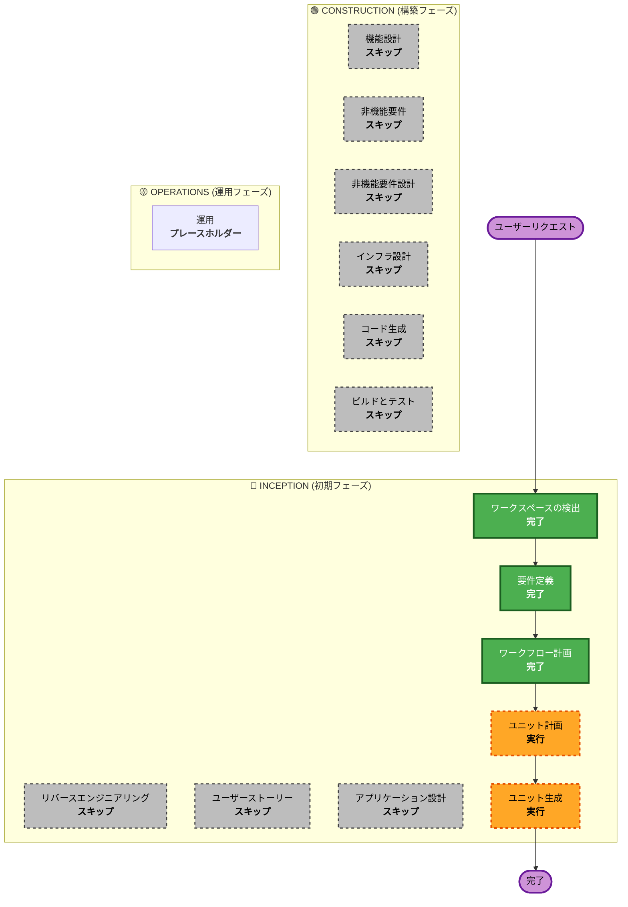

# 実行計画 (Execution Plan)

## 詳細分析サマリー

### 影響範囲の評価 (Change Impact Assessment)
- **ユーザー向け変更**: なし (親アーキテクチャレイヤーのため)
- **構造的変更**: あり (マルチエージェント AI-DLC アーキテクチャの導入)
- **データモデル変更**: なし (子AI-DLCへ委譲)
- **API変更**: なし (子AI-DLCへ委譲)
- **NFR (非機能要件) への影響**: なし (子AI-DLCへ委譲)

### リスク評価 (Risk Assessment)
- **リスクレベル**: 低 (ドキュメント作成とタスク委譲のみ)
- **ロールバックの複雑さ**: 容易
- **テストの複雑さ**: シンプル (ドキュメントのレビューのみ)

## ワークフローの可視化

## 実行するフェーズ

### 🔵 INCEPTION (初期フェーズ)
- [x] ワークスペースの検出 (完了)
- [x] リバースエンジニアリング (スキップ)
- [x] 要件定義 (完了)
- [x] ユーザーストーリー (スキップ)
- [x] 実行計画の作成 (完了)
- [ ] アプリケーション設計 - スキップ
  - **理由**: アプリケーション設計は各子AI-DLC内で実施するため不要。
- [ ] ユニット計画 - 実行
  - **理由**: 各サブシステムに渡す要件ドキュメントの構造と内容を計画するため。
- [ ] ユニット生成 - 実行
  - **理由**: 計画に基づき、各子AI-DLCのワークスペースに実際に要件・指示ドキュメントを生成するため。

### 🟢 CONSTRUCTION (構築フェーズ)
- [ ] 機能設計 - スキップ
- [ ] 非機能要件 - スキップ
- [ ] 非機能要件設計 - スキップ
- [ ] インフラ設計 - スキップ
- [ ] コード生成 - スキップ
  - **理由**: 親AI-DLCではコードの実装は行わないため。
- [ ] ビルドとテスト - スキップ
  - **理由**: 親AI-DLCではテストは行わないため。

### 🟡 OPERATIONS (運用フェーズ)
- [ ] 運用 - プレースホルダー

## 見積もりスケジュール
- **合計フェーズ数**: 2 (ユニット計画、ユニット生成)
- **予想所要時間**: 約1時間

## 成功基準
- **主要な目標**: 子AI-DLCへ渡すための要件・仕様ドキュメントをすべて生成すること。
- **主な成果物**: ロガーシステム、データ蓄積システム、日誌作成システム、デジタルツインシステムに対する初期要件およびインテント(意図)仕様書。
