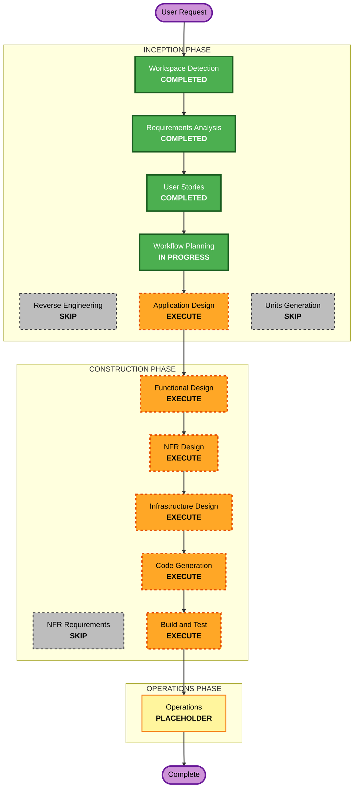

# Execution Plan

## Detailed Analysis Summary

### Change Impact Assessment

- **User-facing changes**: Yes
  - Notion 上に日報ページを自動生成し、利用者が日々の活動を振り返る体験に直接影響する。
- **Structural changes**: Yes
  - AWS Lambda、EventBridge、Secrets Manager、DynamoDB 読み取り、Bedrock、Notion API 連携を持つ新規バッチシステムを構築する。
- **Data model changes**: Yes
  - `user_id`、対象日、タイムゾーン、Notion 設定、日報出力モデル、処理ログを扱う。
- **API changes**: Yes
  - Notion API、Bedrock API、AWS SDK による DynamoDB / Secrets Manager / CloudWatch Logs 連携が必要。
- **NFR impact**: Yes
  - Security Baseline と PBT が有効。秘匿情報管理、IAM 最小権限、構造化ログ、PBT 対象ロジックの明確化が必要。

### Risk Assessment

- **Risk Level**: Medium
- **Rollback Complexity**: Moderate
- **Testing Complexity**: Moderate

主なリスクは、対象日判定の誤り、`user_id` 分離漏れ、Notion token の露出、LLM 入力の過剰ログ出力、外部 API 失敗時の扱いである。PBT と Security Baseline を有効化しているため、後続フェーズで設計とテストの粒度を上げて扱う。

## Workflow Visualization

Text alternative:

- Workspace Detection: Completed
- Reverse Engineering: Skipped, greenfield workspace
- Requirements Analysis: Completed
- User Stories: Completed
- Workflow Planning: In progress
- Application Design: Execute
- Units Generation: Skip
- Functional Design: Execute
- NFR Requirements: Skip
- NFR Design: Execute
- Infrastructure Design: Execute
- Code Generation: Execute
- Build and Test: Execute
- Operations: Placeholder

## Phases to Execute

### INCEPTION PHASE

- [x] Workspace Detection - COMPLETED
  - **Rationale**: 新規 `daily-log` ワークスペースとして Greenfield 判定済み。
- [x] Reverse Engineering - SKIP
  - **Rationale**: 既存アプリケーションコードがない。
- [x] Requirements Analysis - COMPLETED
  - **Rationale**: `requirements.md` 作成済み、ユーザー承認済み。
- [x] User Stories - COMPLETED
  - **Rationale**: `stories.md` と `personas.md` 作成済み、ユーザー承認済み。
- [x] Workflow Planning - IN PROGRESS
  - **Rationale**: 本計画を作成中。
- [ ] Application Design - EXECUTE
  - **Rationale**: 日付判定、データ取得、LLM 生成、Notion 出力、エラー処理、セキュリティ境界を持つ複数コンポーネントが必要。
- [ ] Units Generation - SKIP
  - **Rationale**: `daily-log` は親AI-DLC配下の単一子ユニットであり、さらに子ユニットへ分割する段階ではない。

### CONSTRUCTION PHASE

- [ ] Functional Design - EXECUTE
  - **Rationale**: 対象日判定、タイムゾーン変換、`user_id` 分離、Notion 出力モデル、既存ページ非上書きなどのビジネスロジックを設計する必要がある。
- [ ] NFR Requirements - SKIP
  - **Rationale**: Security、ログ、スケーラビリティ、PBT の基本要件は `requirements.md` に明記済み。追加の要件収集ではなく設計に進む。
- [ ] NFR Design - EXECUTE
  - **Rationale**: Security Baseline と PBT が有効であり、具体的なログ、秘匿情報管理、テスト可能プロパティ、依存関係管理を設計する必要がある。
- [ ] Infrastructure Design - EXECUTE
  - **Rationale**: Lambda、EventBridge、Secrets Manager、IAM、CloudWatch Logs、Bedrock、DynamoDB 読み取り権限を設計する必要がある。
- [ ] Code Generation - EXECUTE
  - **Rationale**: Python Lambda とテストコードの実装が必要。
- [ ] Build and Test - EXECUTE
  - **Rationale**: ユニットテスト、PBT、モック統合テスト、ビルド検証が必要。

### OPERATIONS PHASE

- [ ] Operations - PLACEHOLDER
  - **Rationale**: デプロイ後の運用、監視、アラート、再実行管理は将来の運用フェーズで扱う。

## Execution Plan Summary

- **Total Stages to Execute**: 6
- **Stages to Execute**: Application Design, Functional Design, NFR Design, Infrastructure Design, Code Generation, Build and Test
- **Stages to Skip**: Reverse Engineering, Units Generation, NFR Requirements
- **Next Stage**: Application Design

## Estimated Timeline

- **Total Phases**: 6 execution stages remaining before initial build/test completion
- **Estimated Duration**: Medium

## Success Criteria

- Application components and responsibilities are clearly defined.
- Functional design identifies business rules and testable properties.
- Security Baseline has no blocking findings.
- PBT-applicable pure functions and properties are documented.
- Infrastructure design uses least-privilege IAM and secure secret handling.
- Python Lambda implementation can generate a Notion daily log from DynamoDB data.
- Build and test stage verifies date filtering, `user_id` isolation, Notion output model, secret non-logging, and failure handling.
