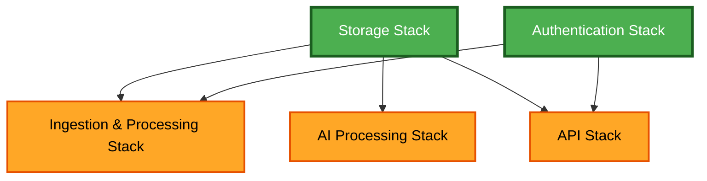
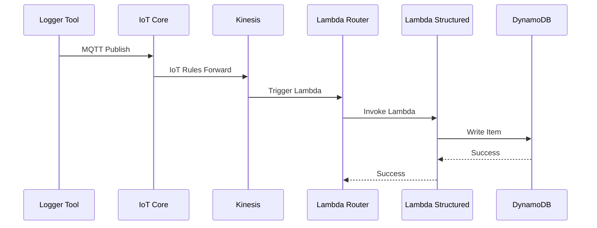
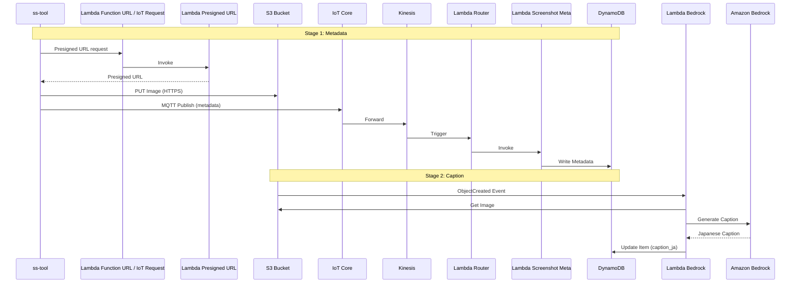

# Unit of Work Dependency Matrix

## Overview
このドキュメントは、各ユニット間の依存関係、統合ポイント、データフローを定義します。

---

## Dependency Matrix

| From Unit | To Unit | Dependency Type | Integration Point | Data Flow |
|-----------|---------|-----------------|-------------------|-----------|
| Ingestion & Processing | Storage | Runtime | DynamoDB Write | メッセージデータ → DynamoDB |
| Ingestion & Processing | Authentication | Deployment | IoT Core Policy | 認証済みクライアント → IoT Core |
| Lambda Bedrock | Storage | Runtime | S3 Read, DynamoDB Update | S3画像 → キャプション → DynamoDB |
| Lambda Presigned URL | Storage | Runtime | S3 Presigned URL | Presigned URL生成 |
| Lambda Presigned URL | Authentication | Runtime | Cognito Authorization | ユーザー認証 → API呼び出し |

**Dependency Types**:
- **Runtime**: 実行時の依存関係（API呼び出し、データアクセス）
- **Deployment**: デプロイ時の依存関係（CloudFormation Export/Import）
- **Configuration**: 設定の依存関係（環境変数、パラメータ）

---

## CloudFormation Stack Dependencies

### Dependency Graph


**Legend**:
- 🟢 Green: 基盤スタック（依存関係なし）
- 🟠 Orange: サービススタック（基盤に依存）

### Stack Export/Import Details

#### Storage Stack Exports
```yaml
Outputs:
  DynamoDBTableName:
    Description: DynamoDB table name for activities
    Value: !Ref ActivitiesTable
    Export:
      Name: !Sub "${AWS::StackName}-DynamoDBTableName"
  
  DynamoDBTableArn:
    Description: DynamoDB table ARN
    Value: !GetAtt ActivitiesTable.Arn
    Export:
      Name: !Sub "${AWS::StackName}-DynamoDBTableArn"
  
  ScreenshotsBucketName:
    Description: S3 bucket name for screenshots
    Value: !Ref ScreenshotsBucket
    Export:
      Name: !Sub "${AWS::StackName}-ScreenshotsBucketName"
  
  ScreenshotsBucketArn:
    Description: S3 bucket ARN for screenshots
    Value: !GetAtt ScreenshotsBucket.Arn
    Export:
      Name: !Sub "${AWS::StackName}-ScreenshotsBucketArn"
  
  VectorsBucketName:
    Description: S3 bucket name for vectors
    Value: !Ref VectorsBucket
    Export:
      Name: !Sub "${AWS::StackName}-VectorsBucketName"
```

#### Authentication Stack Exports
```yaml
Outputs:
  CognitoUserPoolId:
    Description: Cognito User Pool ID
    Value: !Ref UserPool
    Export:
      Name: !Sub "${AWS::StackName}-CognitoUserPoolId"
  
  CognitoUserPoolArn:
    Description: Cognito User Pool ARN
    Value: !GetAtt UserPool.Arn
    Export:
      Name: !Sub "${AWS::StackName}-CognitoUserPoolArn"
  
  CognitoIdentityPoolId:
    Description: Cognito Identity Pool ID
    Value: !Ref IdentityPool
    Export:
      Name: !Sub "${AWS::StackName}-CognitoIdentityPoolId"
  
  IoTCoreEndpoint:
    Description: IoT Core endpoint
    Value: !GetAtt IoTEndpoint.Address
    Export:
      Name: !Sub "${AWS::StackName}-IoTCoreEndpoint"
```

#### Ingestion & Processing Stack Imports
```yaml
Parameters:
  StorageStackName:
    Type: String
    Description: Name of the Storage stack
  
  AuthStackName:
    Type: String
    Description: Name of the Authentication stack

Resources:
  RouterFunction:
    Type: AWS::Lambda::Function
    Properties:
      Environment:
        Variables:
          DYNAMODB_TABLE_NAME: 
            Fn::ImportValue: !Sub "${StorageStackName}-DynamoDBTableName"
```

---

## Integration Points

### 1. IoT Core → Kinesis → Lambda Router
**Type**: Event-driven messaging
**Protocol**: AWS SDK (Kinesis)
**Data Format**: JSON (IoT Core message)

**Flow**:
1. IoT Core receives MQTT message from logger tools
2. IoT Rules Engine forwards to Kinesis Data Streams
3. Kinesis triggers Lambda Router
4. Lambda Router routes to appropriate processing Lambda

**Error Handling**:
- Kinesis retry with exponential backoff
- Dead Letter Queue for failed messages
- CloudWatch Logs for debugging

---

### 2. Lambda Router → Lambda Structured/Screenshot Meta
**Type**: Direct Lambda invocation
**Protocol**: AWS SDK (Lambda)
**Data Format**: JSON (parsed message)

**Flow**:
1. Lambda Router parses message
2. Identifies logger_type and event_type
3. Invokes appropriate Lambda function
4. Passes parsed data as event

**Error Handling**:
- Lambda retry (2 attempts)
- Error logged to CloudWatch
- Failed invocations sent to DLQ

---

### 3. Lambda Structured/Screenshot Meta → DynamoDB
**Type**: Database write
**Protocol**: AWS SDK (DynamoDB)
**Data Format**: DynamoDB Item (JSON)

**Flow**:
1. Lambda receives parsed message
2. Transforms to common schema
3. Writes to DynamoDB table
4. Returns success/failure

**Error Handling**:
- DynamoDB automatic retry
- Conditional writes for idempotency
- CloudWatch metrics for throttling

---

### 4. S3 ObjectCreated → Lambda Bedrock
**Type**: Event notification
**Protocol**: S3 Event Notification
**Data Format**: S3 Event (JSON)

**Flow**:
1. Screenshot uploaded to S3
2. S3 triggers ObjectCreated event
3. Lambda Bedrock receives event
4. Processes image and updates DynamoDB

**Error Handling**:
- Lambda retry (2 attempts)
- S3 event replay capability
- CloudWatch Logs for debugging

---

### 5. Lambda Bedrock → Amazon Bedrock
**Type**: API call
**Protocol**: AWS SDK (Bedrock Runtime)
**Data Format**: Bedrock request/response (JSON)

**Flow**:
1. Lambda retrieves image from S3
2. Constructs Bedrock prompt
3. Calls Bedrock Nova Lite model
4. Receives Japanese caption
5. Updates DynamoDB record

**Error Handling**:
- Bedrock throttling retry
- Model timeout handling
- Fallback to default caption

---

### 6. Presigned URL Request → Lambda Presigned URL
**Type**: Dual request interface
**Protocol**: HTTPS for Chrome extension, MQTTS Request/Response for ss-tool
**Data Format**: JSON

**Flow**:
1. Chrome extension sends POST request to Lambda Function URL with IAM authentication from Cognito ID Pool
2. ss-tool sends request to IoT Core Request/Response topic with X.509 authentication
3. Lambda validates caller identity and requested file metadata
4. Lambda generates S3 Presigned URL under the allowed user/device prefix
5. Lambda returns URL through HTTPS response or IoT Core response topic

**Error Handling**:
- Lambda Function URL 4xx/5xx responses for Chrome extension
- IoT Core response error payload for ss-tool
- Lambda error mapping
- CloudWatch Lambda metrics

---

### 7. Lambda Presigned URL → S3
**Type**: Presigned URL generation
**Protocol**: AWS SDK (S3)
**Data Format**: Presigned URL (string)

**Flow**:
1. Lambda receives request with file metadata
2. Validates user_id from Cognito identity or X.509/IoT Core context
3. Generates S3 Presigned URL with user_id prefix
4. Returns URL with expiration time

**Error Handling**:
- IAM permission validation
- URL expiration handling
- User_id mismatch rejection

---

## Data Flow Diagrams

### Flow 1: Structured Data (Browser, OS API)


### Flow 2: Screenshot Processing (2-stage)


---

## Circular Dependency Check

### Analysis Result: ✅ No Circular Dependencies

**Dependency Chain**:
1. Storage (no dependencies)
2. Authentication (no dependencies)
3. Ingestion & Processing → Storage, Authentication
4. Lambda Bedrock → Storage
5. Lambda Presigned URL → Storage, Authentication

**Validation**:
- All dependencies flow in one direction
- No unit depends on a unit that depends on it
- Deployment order is clear and unambiguous

---

## Cross-Stack Communication Patterns

### Pattern 1: CloudFormation Export/Import
**Use Case**: Static resource references (table names, ARNs)
**Pros**: Type-safe, validated at deployment
**Cons**: Tight coupling, stack deletion restrictions

**Example**:
```yaml
# Storage Stack
Outputs:
  DynamoDBTableName:
    Export:
      Name: !Sub "${AWS::StackName}-DynamoDBTableName"

# Ingestion Stack
Resources:
  LambdaFunction:
    Environment:
      Variables:
        TABLE_NAME:
          Fn::ImportValue: !Sub "${StorageStackName}-DynamoDBTableName"
```

### Pattern 2: Environment Variables
**Use Case**: Runtime configuration, environment-specific values
**Pros**: Flexible, easy to change
**Cons**: No type safety, manual coordination

**Example**:
```bash
# Deployment script
export DYNAMODB_TABLE_NAME=$(aws cloudformation describe-stacks \
  --stack-name storage-stack \
  --query 'Stacks[0].Outputs[?OutputKey==`DynamoDBTableName`].OutputValue' \
  --output text)

aws cloudformation deploy \
  --template-file iac/ingestion-processing.yaml \
  --parameter-overrides DynamoDBTableName=$DYNAMODB_TABLE_NAME
```

---

## Dependency Management Best Practices

### 1. Minimize Cross-Stack Dependencies
- Use CloudFormation Export/Import only for essential resources
- Prefer loose coupling through event-driven architecture
- Document all cross-stack dependencies

### 2. Version Compatibility
- Maintain backward compatibility for shared resources
- Use semantic versioning for Lambda Layers
- Test stack updates in isolation

### 3. Deployment Orchestration
- Deploy stacks in dependency order
- Validate exports before importing stacks
- Use deployment scripts for automation

### 4. Rollback Strategy
- Test rollback scenarios
- Document rollback dependencies
- Maintain previous stack versions

---

## Success Criteria

- [ ] All unit dependencies are documented
- [ ] No circular dependencies exist
- [ ] CloudFormation Export/Import strategy is defined
- [ ] Integration points are clearly specified
- [ ] Data flow diagrams are complete
- [ ] Error handling is defined for each integration
- [ ] Deployment order is validated

---

**Document Status**: Complete
**Next Step**: Generate unit-to-story mapping
