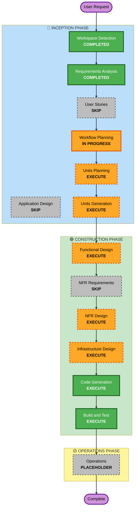

# Execution Plan

## Detailed Analysis Summary

### Change Impact Assessment
- **User-facing changes**: No - This is a backend data accumulation system with no direct user interface
- **Structural changes**: Yes - Complete new AWS serverless architecture with multiple services
- **Data model changes**: Yes - New DynamoDB schema, S3 storage structure, and Knowledge Base integration
- **API changes**: Yes - Presigned URL generation via Lambda Function URL for Chrome extension and IoT Core Request/Response for ss-tool
- **NFR impact**: Yes - Performance, security, cost optimization, and observability requirements

### Risk Assessment
- **Risk Level**: Medium-High
- **Rationale**: 
  - Complex multi-service AWS architecture with multiple integration points
  - AI/ML integration with Amazon Bedrock requires careful testing
  - Multi-tenant data isolation is critical for security
  - Multiple authentication mechanisms (X.509, Cognito) need proper configuration
- **Rollback Complexity**: Moderate
  - Infrastructure as Code (CloudFormation) enables clean rollback
  - No existing production system to migrate from
  - Greenfield deployment reduces rollback complexity
- **Testing Complexity**: Complex
  - Multiple data flows requiring end-to-end testing
  - S3 event-driven architecture needs integration testing
  - Bedrock integration requires mock/stub strategies
  - Multi-tenant isolation requires thorough security testing

---

## Workflow Visualization

---

## Phases to Execute

### 🔵 INCEPTION PHASE

- [x] **Workspace Detection** - COMPLETED
  - **Rationale**: Identified as Greenfield project with no existing code

- [x] **Requirements Analysis** - COMPLETED
  - **Rationale**: Comprehensive requirements document created with unified schema

- [ ] **User Stories** - SKIP
  - **Rationale**: Backend data accumulation system with no direct user interface. User stories not needed as the system interfaces are well-defined (IoT Core topics, Lambda Function URL / IoT Core Request/Response for Presigned URL, and MQTT payloads) and the requirements document already contains detailed interface specifications.

- [x] **Workflow Planning** - IN PROGRESS
  - **Rationale**: Creating execution plan to determine which phases to execute

- [ ] **Application Design** - SKIP
  - **Rationale**: This is an infrastructure-heavy serverless project. Component boundaries are already well-defined in requirements (Lambda functions, IoT Core, Kinesis, DynamoDB, S3, Bedrock). No complex business logic or service layer design needed - each Lambda has a clear, single responsibility.

- [ ] **Units Planning** - EXECUTE
  - **Rationale**: Need to break down the system into implementable units:
    - Infrastructure stacks (IoT Core, Kinesis, DynamoDB, S3, Lambda Function URL, IoT Core Request/Response)
    - Lambda functions (Router, Structured, Screenshot Meta, Bedrock, Presigned URL)
    - Authentication configurations (X.509, Cognito)
    - Monitoring and error handling setup

- [ ] **Units Generation** - EXECUTE
  - **Rationale**: Need to generate detailed specifications for each unit including:
    - CloudFormation template structures
    - Lambda function interfaces and dependencies
    - DynamoDB table definitions with GSIs
    - S3 bucket policies and lifecycle rules
    - IoT Core rules and topic configurations

### 🟢 CONSTRUCTION PHASE

- [ ] **Functional Design** - EXECUTE
  - **Rationale**: Need detailed design for:
    - Lambda function logic (message routing, schema transformation, Bedrock integration)
    - IoT Rules Engine SQL queries
    - DynamoDB query patterns and access patterns
    - S3 event notification configuration
    - Error handling and retry logic

- [ ] **NFR Requirements** - SKIP
  - **Rationale**: NFR requirements are already comprehensively documented in requirements.md Section 3 (Non-Functional Requirements). No additional NFR requirements gathering needed.

- [ ] **NFR Design** - EXECUTE
  - **Rationale**: Need to design implementation for:
    - Multi-tenant data isolation (IAM policies, topic filters)
    - Performance optimization (Kinesis shard configuration, Lambda concurrency)
    - Cost optimization (DynamoDB on-demand vs provisioned, S3 lifecycle policies)
    - Security implementation (encryption, certificate management)
    - Observability (CloudWatch metrics, alarms, structured logging)

- [ ] **Infrastructure Design** - EXECUTE
  - **Rationale**: Need detailed infrastructure design for:
    - CloudFormation stack organization and dependencies
    - IAM roles and policies for each service
    - VPC configuration (if needed for Lambda)
    - Resource naming conventions
    - Environment variable management
    - Cross-stack references and outputs

- [ ] **Code Generation** - EXECUTE (ALWAYS)
  - **Rationale**: Implementation planning and code generation for:
    - CloudFormation templates for all infrastructure
    - Lambda function code (Python 3.12)
    - Shared libraries and utilities
    - Configuration files
    - Deployment scripts

- [ ] **Build and Test** - EXECUTE (ALWAYS)
  - **Rationale**: Build, test, and verification:
    - Unit tests for Lambda functions
    - Integration tests for data flows
    - CloudFormation template validation
    - Security testing for multi-tenant isolation
    - End-to-end testing with mock data

### 🟡 OPERATIONS PHASE

- [ ] **Operations** - PLACEHOLDER
  - **Rationale**: Future deployment and monitoring workflows (out of scope for initial implementation)

---

## Estimated Timeline

- **Total Phases to Execute**: 8 phases
  - Inception: 2 phases (Units Planning, Units Generation)
  - Construction: 5 phases (Functional Design, NFR Design, Infrastructure Design, Code Generation, Build and Test)
  - Operations: 0 phases (placeholder)

- **Estimated Duration**: 
  - Units Planning: 1-2 hours
  - Units Generation: 2-3 hours
  - Functional Design: 3-4 hours
  - NFR Design: 2-3 hours
  - Infrastructure Design: 3-4 hours
  - Code Generation: 6-8 hours
  - Build and Test: 4-6 hours
  - **Total**: 21-30 hours of AI-assisted development

---

## Success Criteria

### Primary Goal
Build a production-ready AWS serverless backend system that:
- Accepts data from 3 logger tools (chrome-extension, osapi, ss-tool)
- Processes and normalizes data into a unified schema
- Generates Japanese captions for screenshots using Bedrock
- Stores data in DynamoDB with proper multi-tenant isolation
- Enables RAG-based search via Bedrock Knowledge Base with S3 Vectors

### Key Deliverables
1. **Infrastructure as Code**:
   - CloudFormation templates for all AWS resources
   - Organized in function-based stack structure
   - Parameterized for different environments

2. **Lambda Functions**:
   - Router: Message type identification and routing
   - Structured: Direct schema transformation for structured data
   - Screenshot Meta: Metadata-only storage for screenshots
   - Bedrock: S3-triggered image caption generation
   - Presigned URL: Secure URL generation for image uploads

3. **Data Storage**:
   - DynamoDB table with unified schema and GSIs
   - S3 buckets for raw screenshots and vectors
   - Bedrock Knowledge Base configuration

4. **Authentication & Authorization**:
   - X.509 certificate provisioning for local apps
   - Cognito User Pool and ID Pool for Chrome extension
   - IAM policies for multi-tenant isolation

5. **Monitoring & Error Handling**:
   - CloudWatch alarms for critical errors
   - Dead Letter Queues for failed messages
   - Structured logging for all Lambda functions

### Quality Gates
1. **Functional Completeness**:
   - All 3 data flows working end-to-end
   - Screenshot caption generation producing Japanese text
   - Multi-tenant data isolation verified

2. **Non-Functional Requirements**:
   - Message ingestion latency < 1 second
   - Bedrock processing latency < 30 seconds
   - Multi-tenant isolation security tested
   - Cost projections within $50/month target

3. **Code Quality**:
   - All Lambda functions have unit tests
   - CloudFormation templates validated
   - Integration tests pass for all data flows
   - Documentation complete for all components

4. **Operational Readiness**:
   - CloudWatch alarms configured
   - Error handling and retry logic tested
   - Deployment scripts working
   - Rollback procedures documented

---

## Next Steps

1. **Immediate**: Complete Workflow Planning (this document)
2. **Next Stage**: Units Planning
   - Break down system into implementable units
   - Define unit boundaries and dependencies
   - Create unit specifications

3. **Following Stages**: Execute remaining phases in sequence
   - Units Generation → Functional Design → NFR Design → Infrastructure Design → Code Generation → Build and Test

---

**Document Status**: Approved / Complete
**Approval Required**: No
**Next Phase**: Units Planning
