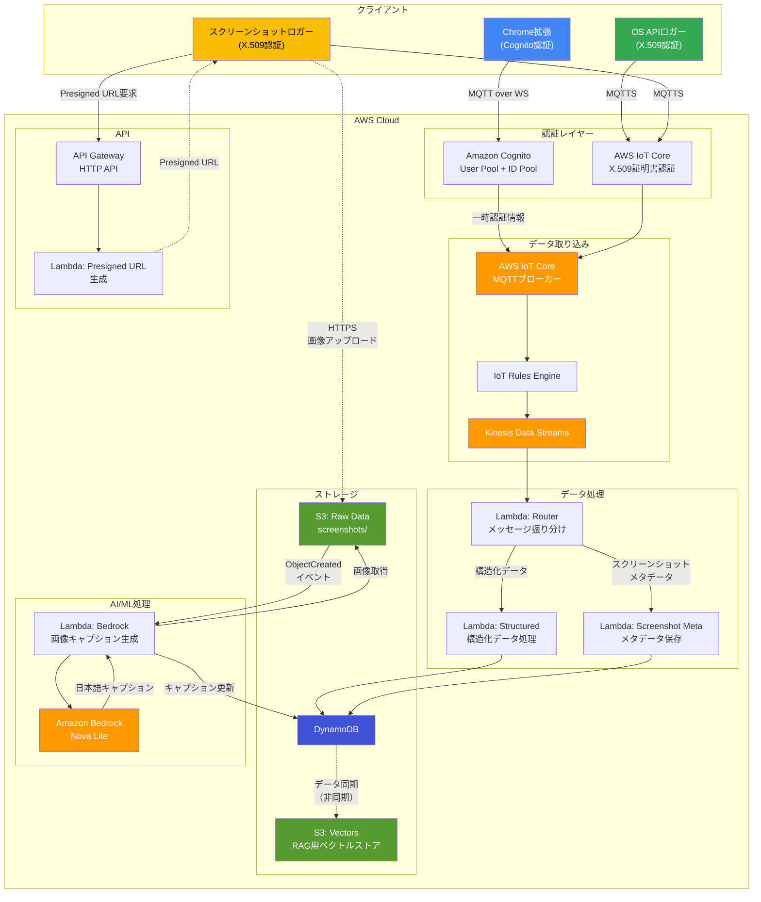

# 要件定義書: データ蓄積システム

**プロジェクト**: ShadowSync - データ蓄積バックエンド
**バージョン**: 1.0
**日付**: 2026-05-09
**ステータス**: 承認済み

---

## 1. 意図分析サマリー

### 1.1 ユーザーリクエスト
個人活動ログ自動集計・活用システム「ShadowSync」のコアとなるAWSバックエンドシステムを構築する。クライアント（data-logger）から非同期で送られてくる多種多様な生データ（ログ、スクリーンショット画像）を受け付け、意味のある共通形式に変換・正規化して蓄積する。

### 1.2 リクエストタイプ
**新規プロジェクト** - AWSサーバーレスバックエンドシステムのグリーンフィールド開発

### 1.3 スコープ見積もり
**システム全体** - 以下を含む完全なバックエンドインフラストラクチャ:
- IoT Coreデータ取り込みパイプライン
- 認証・認可基盤
- データ処理・変換パイプライン
- ストレージレイヤー（DynamoDB、S3、Knowledge Base）
- モニタリングとエラーハンドリング

### 1.4 複雑度見積もり
**複雑** - 以下を含むマルチサービスAWSアーキテクチャ:
- 複数の認証メカニズム（X.509、Cognito）
- AI/ML統合（Amazon Bedrock）
- マルチテナントデータ分離
- リアルタイムおよびバッチ処理パイプライン
- Infrastructure as Code実装

---

## 2. 機能要件

### 2.1: AWSインフラストラクチャアーキテクチャ

#### 2.1.1: データフローアーキテクチャ図



#### 2.1.2: データフロー説明

**フロー1: 構造化データ（Chrome拡張、OS APIロガー）**
1. クライアント → IoT Core（MQTT/MQTTS）
2. IoT Rules Engine → Kinesis Data Streams
3. Lambda Router → メッセージタイプ判定
4. Lambda Structured → 共通スキーマ変換
5. DynamoDB → データ保存

**フロー2: スクリーンショット（2段階処理）**

*第1段階: メタデータ保存*
1. ss-tool → API Gateway（Presigned URL要求）
2. Lambda Presigned → Presigned URL生成
3. ss-tool → S3（画像直接アップロード、WebP形式）
4. ss-tool → IoT Core（メタデータ送信）
5. IoT Rules → Kinesis → Lambda Router
6. Lambda Screenshot Meta → メタデータのみDynamoDBに保存

*第2段階: キャプション生成（S3イベントトリガー）*
1. S3 ObjectCreated イベント → Lambda Bedrock起動
2. Lambda Bedrock → S3から画像取得
3. Lambda Bedrock → Bedrock Nova Lite（日本語キャプション生成）
4. Lambda Bedrock → DynamoDBの既存レコードを更新（caption_ja追加）

---

### FR-1: データ取り込みパイプライン

#### FR-1.1: IoT Coreメッセージ受信
- **説明**: AWS IoT Core経由で3つのロガーツールからメッセージを受け付ける
- **入力ソース**:
  - **Chrome拡張ロガー（chrome-extension）**:
    - 認証: Amazon Cognito IDプール（MQTT over WebSockets、ポート443）
    - データ: ブラウザアクティビティ（URL、ページタイトル、HTMLスニペット）
    - トピック: `shadowsync/logs/{user_id}/{device_id}/browser`
  - **OS APIロガー（osapi）**:
    - 認証: X.509デバイス証明書（MQTTS）
    - データ: ウィンドウ切り替え、オーディオセッション、定期スナップショット
    - トピック: `shadowsync/logs/{user_id}/{device_id}/{window|audio|snapshot}`
  - **スクリーンショットロガー（ss-tool）**:
    - 認証: X.509デバイス証明書（MQTTS - メタデータ）、IAM/Presigned URL（S3 - 画像本体）
    - データ: スクリーンショットメタデータ（S3パス、解像度、アクティブウィンドウ情報）
    - トピック: `shadowsync/logs/{user_id}/{device_id}/screenshot`
    - 画像本体: S3直接アップロード（WebP形式）
- **メッセージタイプ**:
  - ブラウザアクティビティ（URL、ページタイトル、HTMLスニペット）
  - ウィンドウアクティビティ（タイトル、プロセス名）
  - オーディオセッション情報
  - 定期スナップショット
  - スクリーンショットメタデータ

#### FR-1.2: 認証と認可
- **X.509証明書管理**:
  - AWS IoT Core自動プロビジョニングを使用した証明書生成
  - ローカルアプリケーションへの証明書の安全な配布
  - 証明書ローテーション機構の実装
- **Cognito認証フロー**:
  - ユーザー認証のためのCognito User Pools
  - 一時的なAWS認証情報のためのCognito IDプール
  - Chrome拡張機能認証のサポート
- **マルチテナント分離**:
  - ユーザー間のトピックアクセスを防ぐ厳格なIAMポリシーの適用
  - user_idベースのトピックフィルタリングの実装
  - 他ユーザーのトピックへのパブリッシュ/サブスクライブの拒否

#### FR-1.3: メッセージルーティング
- **アーキテクチャ**: IoT Core → IoT Rules → Kinesis Data Streams → Lambda → DynamoDB/S3
- **理由**: Kinesisは高スループット、バッファリング、リトライ機能を提供しスケーラビリティを実現
- **ルーティングロジック**:
  - メッセージタイプ（`logger_type` + `event_type`）に基づいた処理分岐:
    - **構造化データ**: 直接DynamoDBに保存（LLM処理なし）
      - `logger_type: "browser"` - ブラウザアクティビティ
      - `logger_type: "osapi"` - ウィンドウ、オーディオ、スナップショット
    - **スクリーンショットメタデータ**: DynamoDBにメタデータのみ保存
      - `logger_type: "screenshot"` - S3パス、解像度、ウィンドウ情報
      - キャプション生成は別フロー（S3イベントトリガー）
    - **HTMLスニペット**: オプションで保存（設定でON/OFF）
  - メッセージ検証とフィルタリングの処理
  - エラーハンドリングとリトライ

### FR-2: 画像アップロード基盤

#### FR-2.1: Presigned URL生成
- **エンドポイント**: API Gateway HTTP API + Lambda
- **認証**: ユーザー検証のためのCognito統合
- **機能**:
  - S3直接アップロード用のPresigned URL生成
  - URL生成前のユーザーID検証
  - Chrome拡張機能とローカルアプリケーションの両方をサポート

#### FR-2.2: Presigned URLセキュリティ
- **有効期限**: 長期間（1-24時間）の有効性
- **アクセス制御**: user_idベースのS3プレフィックス分離
- **アップロード後検証**: S3アップロード時のLambdaトリガーで以下を検証:
  - ファイルサイズ制限
  - ファイルタイプ検証
  - ユーザー所有権検証
  - メタデータ抽出

#### FR-2.3: S3ストレージ構成
- **バケット構造**: 
  - **スクリーンショット**: `s3://shadowsync-data/raw/screenshots/{user_id}/{device_id}/YYYY/MM/DD/HH-mm-ss.webp`
  - **その他データ**: `s3://shadowsync-data/{user_id}/{type}/{timestamp}-{uuid}.{ext}`
- **画像形式**: WebP（高圧縮率）
- **ライフサイクルポリシー**: 保持とアーカイブルールの設定
- **暗号化**: サーバーサイド暗号化（SSE-S3またはSSE-KMS）

### FR-3: データ変換と正規化

#### FR-3.1: 構造化データの直接マッピング
- **対象データ**: 3つのロガーツールから送信される構造化データ
- **処理方法**: Lambda関数による直接的なスキーマ変換（LLM不要）
- **変換対象**:
  - **Chrome拡張ロガー（logger_type: "browser"）**:
    - ブラウザアクティビティ（URL、ページタイトル）
    - HTMLスニペット（オプション、設定でON/OFF）
  - **OS APIロガー（logger_type: "osapi"）**:
    - ウィンドウ切り替えイベント（window_changed）
    - オーディオセッション変更イベント（audio_session_changed）
    - 定期スナップショット（periodic_snapshot）
  - **スクリーンショットロガー（logger_type: "screenshot"）**:
    - スクリーンショットメタデータ（S3パス、解像度、アクティブウィンドウ情報）
- **処理ロジック**:
  - IoT Coreメッセージを受信
  - `logger_type`と`event_type`で識別
  - 共通スキーマにマッピング
  - DynamoDBに保存

#### FR-3.2: 画像キャプション生成（S3イベントトリガー）
- **対象データ**: S3にアップロードされたスクリーンショット画像
- **トリガー**: S3 ObjectCreated イベント通知
- **モデル**: Amazon Nova Lite（軽量、コスト効率的）
- **処理モード**: 非同期イベント駆動処理
- **処理ステップ**:
  1. S3 ObjectCreated イベントを受信
  2. イベントからS3オブジェクトキーを取得
  3. S3から画像を取得
  4. 画像とプロンプトでBedrockを呼び出し
  5. 日本語キャプションを生成（「何をしているか」の説明）
  6. DynamoDBの既存レコードを検索（s3_object_keyで）
  7. レコードを更新（caption_jaフィールドを追加）
- **利点**:
  - 画像アップロードとキャプション生成の疎結合
  - メタデータは即座に保存、キャプションは非同期で追加
  - S3イベント通知による自動トリガー

#### FR-3.3: 共通スキーマ定義（DynamoDBスキーマ）

**テーブル名**: `shadowsync-activities`

**プライマリキー**:
- パーティションキー: `user_id` (String)
- ソートキー: `timestamp_event_id` (String) - フォーマット: `2026-05-09T12:34:56Z#uuid`

**共通属性**:

| 属性名 | データ型 | 必須 | 説明 | 例 |
|--------|----------|------|------|-----|
| `user_id` | String | ✓ | ユーザー識別子（パーティションキー） | `"user-123"` |
| `timestamp_event_id` | String | ✓ | タイムスタンプ#UUID（ソートキー） | `"2026-05-09T12:34:56Z#abc-123"` |
| `timestamp` | String | ✓ | ISO 8601形式のタイムスタンプ | `"2026-05-09T12:34:56Z"` |
| `device_id` | String | ✓ | デバイス識別子 | `"device-123"` |
| `logger_type` | String | ✓ | ロガータイプ（browser, osapi, screenshot） | `"browser"` |
| `event_type` | String | ✓ | イベントタイプ | `"page_navigation"` |
| `activity_data` | Map | ✓ | イベント固有のデータ（下記参照） | `{...}` |

**activity_data構造（logger_type別）**:

**1. Chrome拡張（logger_type: "browser"）**

| event_type | activity_dataフィールド | データ型 | 必須 | 説明 | 例 |
|------------|------------------------|----------|------|------|-----|
| `page_navigation` | `url` | String | ✓ | ページURL | `"https://github.com/user/repo"` |
| | `title` | String | ✓ | ページタイトル | `"GitHub - user/repo"` |
| | `html_snippet` | String | - | HTMLスニペット（オプション） | `"<html>...</html>"` |

**2. OS APIロガー（logger_type: "osapi"）**

| event_type | activity_dataフィールド | データ型 | 必須 | 説明 | 例 |
|------------|------------------------|----------|------|------|-----|
| `window_changed` | `window_title` | String | ✓ | ウィンドウタイトル | `"VS Code - project.py"` |
| | `process_name` | String | ✓ | プロセス名 | `"Code.exe"` |
| `audio_session_changed` | `audio_sessions` | List | ✓ | オーディオセッション配列 | `[{...}]` |
| | `audio_sessions[].session_id` | String | ✓ | セッションID | `"session-abc-123"` |
| | `audio_sessions[].process_name` | String | ✓ | プロセス名 | `"Spotify.exe"` |
| | `audio_sessions[].volume_level` | Number | ✓ | 音量レベル（0.0-1.0） | `0.75` |
| `periodic_snapshot` | `is_active` | Boolean | ✓ | 入力アクティビティの有無 | `true` |
| | `window_title` | String | ✓ | 現在のウィンドウタイトル | `"Chrome - GitHub"` |
| | `process_name` | String | ✓ | 現在のプロセス名 | `"chrome.exe"` |
| | `audio_sessions` | List | ✓ | 現在のオーディオセッション配列 | `[]` |

**3. スクリーンショットロガー（logger_type: "screenshot"）**

| event_type | activity_dataフィールド | データ型 | 必須 | 説明 | 例 |
|------------|------------------------|----------|------|------|-----|
| `periodic_ss` | `s3_object_key` | String | ✓ | S3オブジェクトキー（WebP） | `"raw/screenshots/user-123/device-123/2026/05/09/12-45-00.webp"` |
| `window_changed` | `screen_index` | Number | ✓ | スクリーン番号 | `0` |
| | `resolution` | String | ✓ | 画面解像度 | `"1920x1080"` |
| | `active_window_title` | String | ✓ | アクティブウィンドウタイトル | `"VS Code - project.py"` |
| | `process_name` | String | ✓ | プロセス名 | `"Code.exe"` |
| | `caption_ja` | String | - | 日本語キャプション（Bedrock処理後） | `"VS Codeでプログラミングをしている画面"` |

**グローバルセカンダリインデックス（GSI）**:

| インデックス名 | パーティションキー | ソートキー | 用途 | 例 |
|---------------|-------------------|-----------|------|-----|
| GSI-1 | `user_id` | `logger_type#timestamp` | ロガータイプ別クエリ | `"browser#2026-05-09T12:34:56Z"` |
| GSI-2 | `user_id` | `event_type#timestamp` | イベントタイプ別クエリ | `"page_navigation#2026-05-09T12:34:56Z"` |
| GSI-3 | `device_id` | `timestamp` | デバイス別クエリ | `"2026-05-09T12:34:56Z"` |

### FR-4: データストレージ

#### FR-4.1: DynamoDBテーブル設計
- **設計パターン**: 単一テーブル設計
- **テーブル名**: `shadowsync-activities`
- **キャパシティモード**: オンデマンド（リクエスト単位の課金）でコスト最適化
- **詳細スキーマ**: FR-3.3の共通スキーマ定義を参照

#### FR-4.2: Amazon Bedrock Knowledge BaseによるRAG検索
- **ベクトルストレージ**: Amazon S3 Vectors（新機能、コスト効率的）
- **構成**: バックエンドとしてS3 Vectorsを使用するAmazon Bedrock Knowledge Base
- **組織**: データ分離のためのユーザー固有のナレッジベース
- **データ取り込み**:
  - DynamoDBに保存されたアクティビティデータをナレッジベースに同期
  - 取り込み対象:
    - ウィンドウタイトルとプロセス名（そのまま）
    - ブラウザアクティビティ（URL、ページタイトル）
    - スクリーンショットの日本語キャプション
    - オーディオセッション情報（プロセス名）
    - タイムスタンプとメタデータ
  - テキスト形式に変換してベクトル化
    - 例1: "2026-05-09 12:34:56 - VS Code (Code.exe) でproject.pyを編集"
    - 例2: "2026-05-09 12:50:00 - GitHub (https://github.com/user/repo) を閲覧"
- **クエリインターフェース**: RAGクエリ用のBedrock Knowledge Base API
- **検索例**: 「昨日Pythonで何を開発していたか」「午後にどんな音楽を聴いていたか」「GitHubでどのリポジトリを見ていたか」

#### FR-4.3: 生データ保持
- **S3ストレージ**: 元のログと画像を保存
- **目的**: AIモデルが改善された場合の再処理を可能にする
- **ライフサイクル**: 90日後にS3 Glacierへのアーカイブを設定

### FR-5: エラーハンドリングと信頼性

#### FR-5.1: リトライメカニズム
- **戦略**: 指数バックオフによる自動リトライ
- **設定**:
  - Lambda: 指数バックオフで2回リトライ
  - Kinesis: 設定可能なリトライ回数
  - Bedrock: スロットリングと一時的エラー時のリトライ

#### FR-5.2: デッドレターキュー（DLQ）
- **実装**: 失敗メッセージ用のSQS DLQ
- **トリガー**: すべてのリトライ試行を使い果たした後
- **モニタリング**: DLQ深度のCloudWatchアラーム
- **リカバリ**: DLQからの手動または自動再処理

#### FR-5.3: データ整合性
- **冪等性**: 重複メッセージ処理の保証
- **トランザクションサポート**: 必要に応じてDynamoDBトランザクションを使用
- **監査証跡**: デバッグ用にすべての処理ステップをログ記録

---

## 3. 非機能要件

### NFR-1: パフォーマンス

#### NFR-1.1: スループット
- **目標**: ユーザーあたり毎分最大1,000メッセージをサポート
- **スケーラビリティ**: オートスケーリング機能付きKinesis Data Streams
- **レイテンシ**: 
  - メッセージ取り込み: < 1秒
  - Bedrock処理: < 30秒（非同期）
  - クエリレスポンス: < 2秒

#### NFR-1.2: 可用性
- **目標**: 取り込みパイプラインの99.9%稼働時間
- **マルチAZ**: 複数のAZにLambdaとDynamoDBをデプロイ
- **フェイルオーバー**: IoT CoreとKinesisの自動フェイルオーバー

### NFR-2: セキュリティ

#### NFR-2.1: 認証
- **IoT Core**: ローカルアプリ用のX.509証明書認証
- **API Gateway**: Chrome拡張機能用のCognito User Poolオーソライザー
- **最小権限の原則**: すべてのサービスに最小限のIAM権限

#### NFR-2.2: データ暗号化
- **転送中**: すべての通信でTLS 1.2以上
- **保管時**: 
  - S3: サーバーサイド暗号化（SSE-S3）
  - DynamoDB: 保管時の暗号化を有効化
  - Kinesis: KMSによるサーバーサイド暗号化

#### NFR-2.3: マルチテナント分離
- **データ分離**: すべてのストレージレイヤーでuser_idベースのパーティショニング
- **アクセス制御**: ユーザー固有のアクセスを強制するIAMポリシー
- **トピック分離**: ユーザー間アクセスを防ぐIoT Coreポリシー

### NFR-3: コスト最適化

#### NFR-3.1: サーバーレスアーキテクチャ
- **Lambda**: 呼び出し単位の課金、アイドルコストなし
- **DynamoDB**: オンデマンドキャパシティモード
- **S3**: ライフサイクルポリシー付きスタンダードストレージ

#### NFR-3.2: AI/MLコスト管理
- **処理の最小化**: 構造化データはLLM処理をスキップ（Lambda直接処理）
- **Bedrock使用**: スクリーンショットのキャプション生成のみ
- **モデル選択**: コスト効率的な処理のためのAmazon Nova Lite
- **バッチ処理**: リアルタイムコストを回避する非同期処理
- **処理頻度**: スクリーンショットのみBedrockを使用（イベント数の大部分を占める構造化データは直接保存）

#### NFR-3.3: モニタリングコスト
- **CloudWatch**: 基本メトリクスのみ（初期段階ではカスタムメトリクスなし）
- **ログ**: CloudWatch Logsの7日間保持
- **アラーム**: 必須アラームのみ（エラー、DLQ深度）

### NFR-4: 保守性

#### NFR-4.1: Infrastructure as Code
- **ツール**: AWS CloudFormation
- **組織**: 機能ベースのスタック構造
  - `iac/ingestion/`: IoT Core、Kinesis、取り込みLambda
  - `iac/processing/`: Bedrock統合、変換Lambda
  - `iac/storage/`: DynamoDB、S3、Knowledge Base
  - `iac/api/`: API Gateway、Presigned URL Lambda
  - `iac/monitoring/`: CloudWatchアラーム、ダッシュボード

#### NFR-4.2: コード組織
- **Lambda関数**: 関数ごとに個別のディレクトリ
- **共有ライブラリ**: 共有レイヤーの共通ユーティリティ
- **設定**: すべての設定可能な値に環境変数を使用

#### NFR-4.3: ドキュメント
- **アーキテクチャ図**: 最新のシステム図を維持
- **APIドキュメント**: すべてのAPIエンドポイントとメッセージスキーマを文書化
- **ランブック**: 一般的なタスクの運用手順

### NFR-5: テスト容易性

#### NFR-5.1: テスト戦略
- **ユニットテスト**: Lambda関数を単独でテスト
- **統合テスト**: AWS上でのサービス間相互作用をテスト
- **E2Eテスト**: IoT Coreからストレージまでの完全なフローをテスト

#### NFR-5.2: テスト環境
- **ローカル開発**: ユニットテストをローカルで実行
- **AWS開発環境**: テスト用の個別のAWSアカウント/リージョン
- **テストデータ**: すべてのシナリオ用の合成テストデータ

#### NFR-5.3: テストカバレッジ
- **目標**: すべてのレイヤーにわたる包括的なテスト
- **範囲**:
  - すべてのLambda関数のユニットテスト
  - サービス間相互作用の統合テスト
  - 重要なユーザーフローのE2Eテスト

### NFR-6: 可観測性

#### NFR-6.1: ロギング
- **プラットフォーム**: CloudWatch Logs
- **フォーマット**: Lambda関数用の構造化ログ（JSON）
- **保持期間**: コスト最適化のため7日間
- **ログレベル**: INFO、WARN、ERROR

#### NFR-6.2: メトリクス
- **基本メトリクス**:
  - Lambda実行エラーと実行時間
  - DynamoDB読み取り/書き込み失敗
  - Kinesisストリームスループット
  - Bedrock呼び出し成功率
- **カスタムメトリクス**: 初期段階ではなし（コスト最適化）

#### NFR-6.3: アラーム
- **重要なアラーム**:
  - Lambda実行エラー > しきい値
  - DLQメッセージ数 > 0
  - DynamoDBスロットリングイベント
  - Kinesisイテレーター経過時間 > しきい値
- **通知**: アラーム通知用のSNSトピック

---

## 4. 技術的制約

### TC-1: AWSサービス
- **クラウドプロバイダー**: AWSのみ
- **リージョン**: 単一リージョンデプロイ（ユーザーの場所に基づいて指定）
- **サーバーレス**: コスト最適化のためサーバーレスサービスを優先

### TC-2: プログラミング言語
- **Lambda関数**: Python 3.12（AWS SDK互換性のため推奨）
- **IaC**: CloudFormation YAML

### TC-3: 外部依存関係
- **最小限の依存関係**: 可能な限りAWS SDKと標準ライブラリを使用
- **Bedrockモデル**: コスト効率のためAmazon Nova Lite
- **サードパーティサービスなし**: すべてのサービスをAWSエコシステム内で

---

## 5. インターフェース仕様

### 5.1: IoT Coreトピック

#### 5.1.1: Chrome拡張ロガー - ブラウザアクティビティ
- **トピックパターン**: `shadowsync/logs/{user_id}/{device_id}/browser`
- **送信タイミング**: ページ遷移、タブ切り替え時
- **認証方式**: Amazon Cognito IDプール（MQTT over WebSockets、ポート443）
- **メッセージフォーマット**:
```json
{
  "user_id": "user-123",
  "device_id": "chrome-ext-abc",
  "timestamp": "2026-05-09T12:34:56Z",
  "logger_type": "browser",
  "event_type": "page_navigation",
  "data": {
    "url": "https://github.com/user/repo",
    "title": "GitHub - user/repo: Project description",
    "html_snippet": "<html>...</html>"
  }
}
```
**注**: `html_snippet`はオプション（設定でON/OFF可能）

#### 5.1.2: OS APIロガー - ウィンドウ切り替え
- **トピックパターン**: `shadowsync/logs/{user_id}/{device_id}/window`
- **送信タイミング**: アクティブウィンドウが変更されたとき
- **認証方式**: X.509デバイス証明書（MQTTS）
- **メッセージフォーマット**:
```json
{
  "user_id": "user-123",
  "device_id": "device-123",
  "timestamp": "2026-05-09T12:34:56Z",
  "logger_type": "osapi",
  "event_type": "window_changed",
  "data": {
    "window_title": "VS Code - project.py",
    "process_name": "Code.exe"
  }
}
```

#### 5.1.3: OS APIロガー - オーディオセッション変更
- **トピックパターン**: `shadowsync/logs/{user_id}/{device_id}/audio`
- **送信タイミング**: Audio Sessionが追加・削除されたとき
- **認証方式**: X.509デバイス証明書（MQTTS）
- **メッセージフォーマット**:
```json
{
  "user_id": "user-123",
  "device_id": "device-123",
  "timestamp": "2026-05-09T12:35:00Z",
  "logger_type": "osapi",
  "event_type": "audio_session_changed",
  "data": {
    "audio_sessions": [
      {
        "session_id": "session-abc-123",
        "process_name": "Spotify.exe",
        "volume_level": 0.75
      }
    ]
  }
}
```

#### 5.1.4: OS APIロガー - 定期スナップショット
- **トピックパターン**: `shadowsync/logs/{user_id}/{device_id}/snapshot`
- **送信タイミング**: 5分間隔
- **認証方式**: X.509デバイス証明書（MQTTS）
- **メッセージフォーマット**:
```json
{
  "user_id": "user-123",
  "device_id": "device-123",
  "timestamp": "2026-05-09T12:40:00Z",
  "logger_type": "osapi",
  "event_type": "periodic_snapshot",
  "data": {
    "is_active": true,
    "window_title": "Chrome - GitHub",
    "process_name": "chrome.exe",
    "audio_sessions": []
  }
}
```

#### 5.1.5: スクリーンショットロガー - メタデータ
- **トピックパターン**: `shadowsync/logs/{user_id}/{device_id}/screenshot`
- **送信タイミング**: スクリーンショット撮影時（periodic_ss、window_changedなど）
- **認証方式**: X.509デバイス証明書（MQTTS）
- **メッセージフォーマット**:
```json
{
  "user_id": "user-123",
  "device_id": "device-123",
  "timestamp": "2026-05-09T12:45:00Z",
  "logger_type": "screenshot",
  "event_type": "periodic_ss",
  "data": {
    "s3_object_key": "raw/screenshots/user-123/device-123/2026/05/09/12-45-00.webp",
    "screen_index": 0,
    "resolution": "1920x1080",
    "active_window_title": "VS Code - project.py",
    "process_name": "Code.exe"
  }
}
```
**注**: 画像本体はS3に直接アップロード（WebP形式、高圧縮率）

### 5.2: API Gatewayエンドポイント

#### 5.2.1: Presigned URL生成
- **メソッド**: POST
- **パス**: `/api/v1/upload/presigned-url`
- **認証**: Cognito User Pool
- **リクエストボディ**:
```json
{
  "file_name": "screenshot.png",
  "content_type": "image/png",
  "file_size": 1048576
}
```
- **レスポンス**:
```json
{
  "presigned_url": "https://s3.amazonaws.com/...",
  "s3_key": "user-123/images/2026-05-09T12:34:56-uuid.png",
  "expires_at": "2026-05-10T12:34:56Z"
}
```

---

## 6. 拡張機能設定

| 拡張機能 | 有効 | 決定段階 |
|---|---|---|
| セキュリティベースライン | いいえ | 要件分析 |
| Property-Based Testing | 部分的 | 要件分析 |

**Property-Based Testingスコープ**: 純粋関数とシリアライゼーションのラウンドトリップのみにPBTルールを適用（アルゴリズム複雑度が限定的なプロジェクトに適している）

---

## 7. スコープ外

以下の項目は明示的にこのプロジェクトのスコープ外です:

1. **日報生成**: レポート生成とユーザー向けUI（他のユニットが担当）
2. **リアルタイム通知**: ユーザーのアクティビティに関するプッシュ通知
3. **高度な分析**: 複雑な分析と可視化ダッシュボード
4. **モバイルアプリケーション**: iOS/Android用のネイティブモバイルアプリ
5. **マルチリージョンデプロイ**: 初期デプロイは単一リージョンのみ
6. **データエクスポート機能**: ユーザーデータの一括エクスポート（後で追加される可能性あり）
7. **サードパーティ統合**: 外部サービス（Slack、Notionなど）との統合

---

## 8. 成功基準

### 8.1: 機能的成功
- [ ] 両方の認証方法でIoT Coreからメッセージを正常に取り込む
- [ ] 画像アップロード用のPresigned URLを生成・検証する
- [ ] Bedrockで画像を処理し、意味のあるコンテキストを抽出する
- [ ] 適切なマルチテナント分離でDynamoDBに正規化データを保存する
- [ ] S3 VectorsでBedrock Knowledge Baseを作成・クエリする
- [ ] リトライとDLQメカニズムでエラーを適切に処理する

### 8.2: 非機能的成功
- [ ] CloudFormationを使用してインフラストラクチャ全体をデプロイする
- [ ] 1秒未満の取り込みレイテンシを達成する
- [ ] 取り込みパイプラインの99.9%稼働時間を維持する
- [ ] 通常使用で月間AWSコストを$50以下に抑える
- [ ] すべてのユニット、統合、E2Eテストに合格する
- [ ] すべてのコンポーネントの完全なドキュメントを作成する

---

## 9. 次のステップ

1. **ワークフロー計画**: 実行フェーズと深度レベルの決定
2. **アプリケーション設計**: コンポーネントアーキテクチャとサービス境界の定義（必要な場合）
3. **ユニット生成**: 実装可能な作業単位への分解（必要な場合）
4. **構築フェーズ**: 詳細設計とコード生成
5. **ビルドとテスト**: 包括的なテストと検証

---

**ドキュメントステータス**: レビュー準備完了
**承認必要**: はい
**次のフェーズ**: ワークフロー計画

