# 実行計画: digital-twin

**プロジェクト**: ShadowSync - digital-twin  
**ステージ**: INCEPTION - ワークフロー計画  
**バージョン**: 1.0  
**日付**: 2026-05-10  
**状態**: 承認済み

---

## 詳細分析サマリー

### プロジェクト種別
- **種別**: Greenfield
- **既存コード**: なし
- **リバースエンジニアリング**: スキップ
- **要求スコープ**: INCEPTIONフェーズのみ

### 変更影響評価
- **ユーザー向け変更**: あり。活動履歴に質問する新規デスクトップ対話アプリケーションを構築する。
- **構造変更**: あり。クライアント、バックエンド、RAG、LLM、履歴、セキュリティの境界を新規に定義する必要がある。
- **データモデル変更**: あり。会話履歴、根拠メタデータ、監査記録、ユーザーコンテキストのモデルが必要。
- **API変更**: あり。Conversation APIと認証済み補助エンドポイントが必要。
- **非機能影響**: あり。セキュリティ、プライバシー、性能、信頼性、保守性、PBTトレースが中心になる。

### リスク評価
- **リスクレベル**: 高
- **理由**:
  - 個人活動ログという高機微データを扱う。
  - マルチテナント分離が安全性の中核要件である。
  - デスクトップクライアント、Cognito認証、RAG検索、Bedrock Nova回答生成、根拠表示、会話履歴を一貫して分離する必要がある。
  - 回答の正確性はdata-accumulation由来の検索品質と根拠メタデータ品質に依存する。
- **ロールバック複雑度**: 中
  - Greenfieldのため既存ランタイム移行は不要。
  - 将来実装では、クライアント、API、ストレージ、インフラの協調変更が必要になる。
- **テスト複雑度**: 複雑
  - ユーザージャーニー、認可境界、RAGフィルタ、プロンプト組み立て、会話永続化、失敗系、監査挙動を検証する必要がある。

### 現在のINCEPTION成果物
- `aidlc-docs/inception/requirements/requirements.md`
- `aidlc-docs/inception/requirements/requirement-verification-questions.md`
- `aidlc-docs/inception/plans/user-stories-assessment.md`
- `aidlc-docs/inception/plans/story-generation-plan.md`
- `aidlc-docs/inception/user-stories/personas.md`
- `aidlc-docs/inception/user-stories/stories.md`

---

## ワークフロー図

```mermaid
flowchart TD
    Start(["ユーザー依頼"])
    
    subgraph INCEPTION["INCEPTIONフェーズ"]
        WD["ワークスペース検出<br/><b>完了</b>"]
        RE["リバースエンジニアリング<br/><b>スキップ</b>"]
        RA["要件分析<br/><b>完了</b>"]
        US["ユーザーストーリー<br/><b>完了</b>"]
        WP["ワークフロー計画<br/><b>レビュー中</b>"]
        AD["アプリケーション設計<br/><b>実行</b>"]
        UP["作業単位計画<br/><b>実行</b>"]
        UG["作業単位生成<br/><b>実行</b>"]
    end
    
    subgraph CONSTRUCTION["CONSTRUCTIONフェーズ"]
        FD["機能設計<br/><b>保留</b>"]
        NFRA["非機能要件<br/><b>保留</b>"]
        NFRD["非機能設計<br/><b>保留</b>"]
        ID["インフラ設計<br/><b>保留</b>"]
        CG["コード生成<br/><b>保留</b>"]
        BT["ビルドとテスト<br/><b>保留</b>"]
    end
    
    subgraph OPERATIONS["OPERATIONSフェーズ"]
        OPS["運用<br/><b>プレースホルダー</b>"]
    end
    
    Start --> WD
    WD --> RE
    RE --> RA
    RA --> US
    US --> WP
    WP --> AD
    AD --> UP
    UP --> UG
    UG -.-> FD
    FD --> NFRA
    NFRA --> NFRD
    NFRD --> ID
    ID --> CG
    CG --> BT
    BT -.-> OPS
    OPS --> End(["完了"])
    
    style WD fill:#4CAF50,stroke:#1B5E20,stroke-width:3px,color:#fff
    style RA fill:#4CAF50,stroke:#1B5E20,stroke-width:3px,color:#fff
    style US fill:#4CAF50,stroke:#1B5E20,stroke-width:3px,color:#fff
    style WP fill:#FFA726,stroke:#E65100,stroke-width:3px,color:#000
    style AD fill:#FFA726,stroke:#E65100,stroke-width:3px,stroke-dasharray: 5 5,color:#000
    style UP fill:#FFA726,stroke:#E65100,stroke-width:3px,stroke-dasharray: 5 5,color:#000
    style UG fill:#FFA726,stroke:#E65100,stroke-width:3px,stroke-dasharray: 5 5,color:#000
    style RE fill:#BDBDBD,stroke:#424242,stroke-width:2px,stroke-dasharray: 5 5,color:#000
    style FD fill:#BDBDBD,stroke:#424242,stroke-width:2px,stroke-dasharray: 5 5,color:#000
    style NFRA fill:#BDBDBD,stroke:#424242,stroke-width:2px,stroke-dasharray: 5 5,color:#000
    style NFRD fill:#BDBDBD,stroke:#424242,stroke-width:2px,stroke-dasharray: 5 5,color:#000
    style ID fill:#BDBDBD,stroke:#424242,stroke-width:2px,stroke-dasharray: 5 5,color:#000
    style CG fill:#BDBDBD,stroke:#424242,stroke-width:2px,stroke-dasharray: 5 5,color:#000
    style BT fill:#BDBDBD,stroke:#424242,stroke-width:2px,stroke-dasharray: 5 5,color:#000
    style OPS fill:#BDBDBD,stroke:#424242,stroke-width:2px,stroke-dasharray: 5 5,color:#000
    style Start fill:#CE93D8,stroke:#6A1B9A,stroke-width:3px,color:#000
    style End fill:#CE93D8,stroke:#6A1B9A,stroke-width:3px,color:#000
    style INCEPTION fill:#BBDEFB,stroke:#1565C0,stroke-width:3px,color:#000
    style CONSTRUCTION fill:#C8E6C9,stroke:#2E7D32,stroke-width:3px,color:#000
    style OPERATIONS fill:#FFF59D,stroke:#F57F17,stroke-width:3px,color:#000
    
    linkStyle default stroke:#333,stroke-width:2px
```

### テキスト代替

1. ワークスペース検出: 完了
2. リバースエンジニアリング: Greenfieldのためスキップ
3. 要件分析: 完了
4. ユーザーストーリー: 完了
5. ワークフロー計画: レビュー中
6. アプリケーション設計: 承認後に実行
7. 作業単位計画: アプリケーション設計後に実行
8. 作業単位生成: 作業単位計画後に実行
9. CONSTRUCTIONフェーズ: 今回の要求範囲がINCEPTIONのみのため保留
10. OPERATIONSフェーズ: プレースホルダー

---

## 実行フェーズ

### INCEPTIONフェーズ

- [x] **ワークスペース検出** - 完了
  - **理由**: digital-twinワークスペースがGreenfieldであり、アプリケーションコードが存在しないことを確認した。

- [x] **リバースエンジニアリング** - スキップ
  - **理由**: `digital-twin` に既存アプリケーションコードがない。

- [x] **要件分析** - 完了
  - **理由**: 要件を確認し、承認済み。

- [x] **ユーザーストーリー** - 完了
  - **理由**: デスクトップ対話UX、根拠表示、履歴、セキュリティ受け入れ条件にはユーザー中心のストーリーが必要。

- [x] **ワークフロー計画** - レビュー中
  - **理由**: 本文書で残りのINCEPTION実行計画を定義する。

- [ ] **アプリケーション設計** - 実行
  - **理由**: デスクトップクライアント、認証、Conversation API、検索、回答生成、根拠表示、履歴、監査について、コンポーネント境界とサービスインターフェースが必要。

- [ ] **作業単位計画** - 実行
  - **理由**: 複数の実装関心事にまたがるため、開発作業単位の境界を明確にする必要がある。

- [ ] **作業単位生成** - 実行
  - **理由**: ユーザーはINCEPTION完了を求めており、承認済み要件でも実装単位への分解を含める方針になっている。

### CONSTRUCTIONフェーズ

- [ ] **機能設計** - 保留
  - **理由**: 将来のCONSTRUCTIONフェーズでは必要だが、今回の要求範囲外である。

- [ ] **非機能要件** - 保留
  - **理由**: セキュリティ、プライバシー、性能、PBTの必要性は要件レベルで特定済み。CONSTRUCTIONレベルの詳細化はまだ開始しない。

- [ ] **非機能設計** - 保留
  - **理由**: Security Baselineと運用制御は将来設計が必要だが、今回の範囲外である。

- [ ] **インフラ設計** - 保留
  - **理由**: Cognito、API、ストレージ、監査、Bedrock連携のインフラ設計は後続で行う。

- [ ] **コード生成** - 保留
  - **理由**: 実装は今回のINCEPTIONのみの要求範囲外である。

- [ ] **ビルドとテスト** - 保留
  - **理由**: ビルドとテストはコード生成後の工程である。

### OPERATIONSフェーズ

- [ ] **運用** - プレースホルダー
  - **理由**: 将来のデプロイと監視ワークフロー。

---

## 推奨する残りINCEPTION手順

1. **アプリケーション設計**
   - コンポーネント設計とサービス設計の成果物を生成する。
   - デスクトップクライアント、認証、会話オーケストレーション、検索、回答生成、根拠表示、会話履歴、監査の責務を定義する。
   - Security Baseline制約をコンポーネント境界で維持する。

2. **作業単位計画**
   - 作業単位計画を作成する。
   - 分解に残る確認事項を質問する。
   - 作業単位がユーザーストーリーとアプリケーションコンポーネントにどう対応するか確認する。

3. **作業単位生成**
   - 作業単位定義、依存関係表、ストーリーから作業単位への対応表を生成する。
   - CONSTRUCTION設計や実装の前で停止する。

---

## 保留中のCONSTRUCTION見通し

将来CONSTRUCTIONが承認された場合、次のステージが必要になる可能性が高い。

- 機能設計: 実行
- 非機能要件: Security BaselineとPBTが有効なため、実行または部分実行を評価
- 非機能設計: 実行
- インフラ設計: 実行
- コード生成: 実行
- ビルドとテスト: 実行

これは参考情報であり、今回の依頼ではCONSTRUCTION作業を開始しない。

---

## 今回のINCEPTIONスコープの成功条件

- 要件が承認済みである。
- ユーザーストーリーとペルソナが承認済みである。
- ワークフロー計画が承認済みである。
- アプリケーションのコンポーネント境界が文書化されている。
- 作業単位が生成され、ユーザーストーリーへ対応付けられている。
- 将来のCONSTRUCTIONに向けて、セキュリティとPBTのトレースが維持されている。
- アプリケーションコードやCONSTRUCTION設計は生成しない。

---

## 拡張ルール適合

| 拡張ルール | 状態 | ワークフロー計画での扱い |
|---|---|---|
| Security Baseline | 有効 | 該当あり。セキュリティに関わるステージは将来設計でも必須。現在の計画では制約を維持し、実装詳細は保留する。 |
| Property-Based Testing | 有効 | 該当あり。PBTトレースは将来の機能設計に引き継ぐ。INCEPTIONではPBT実装は生成しない。 |

### 適合サマリー
- Security Baseline: ワークフロー計画レベルでは適合。
- Property-Based Testing: ワークフロー計画レベルでは適合。
