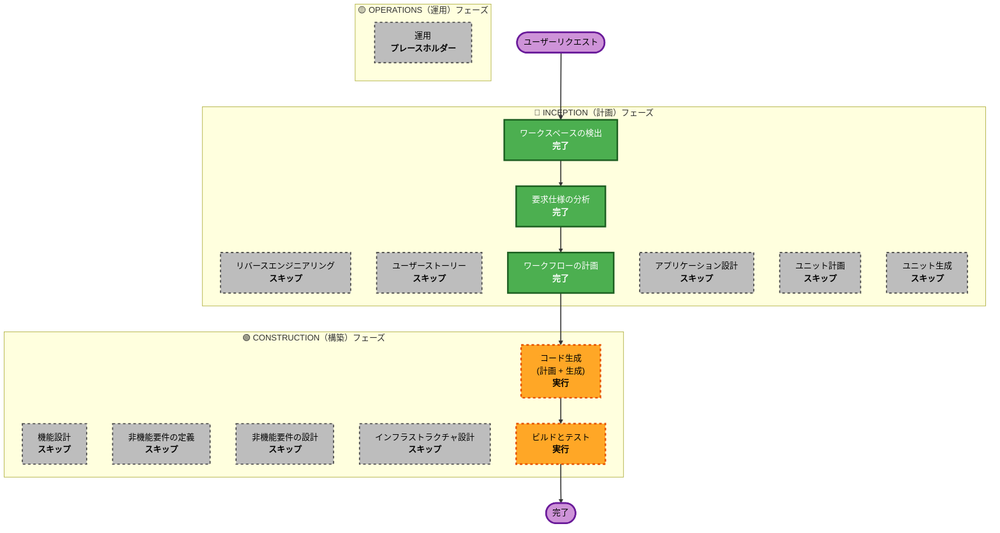

# 実行計画 (Execution Plan)

## 詳細分析サマリー

### 変更による影響の評価
- **ユーザー向け機能の変更**: あり - 設定用のOptions画面を追加します。
- **構造の変更**: あり - 新規のChrome拡張機能の構造（Service Worker、Optionsページ）を作成します。
- **データモデルの変更**: なし - 事前に定義されたJSONスキーマに従います。
- **APIの変更**: なし - 事前に定義されたMQTTトピックを使用します。
- **非機能要件(NFR)への影響**: あり - HTMLスニペット送信時のパフォーマンスとデータ通信量への配慮が必要です。

### リスク評価
- **リスクレベル**: 低 (独立したChrome拡張機能であり、既存システムへの影響がないため)
- **ロールバックの複雑さ**: 容易 (拡張機能のアンインストールや前のバージョンに戻すだけで済むため)
- **テストの複雑さ**: 単純 (ローカルのブラウザ内でテスト可能)

## ワークフローの視覚化

### Mermaid ダイアグラム

### テキストでの代替表現
フェーズ1: INCEPTION (計画)
- ステージ1: ワークスペースの検出 (完了)
- ステージ2: リバースエンジニアリング (スキップ)
- ステージ3: 要求仕様の分析 (完了)
- ステージ4: ユーザーストーリー (スキップ)
- ステージ5: ワークフローの計画 (完了)
- ステージ6: アプリケーション設計 (スキップ)
- ステージ7: ユニット計画 (スキップ)
- ステージ8: ユニット生成 (スキップ)

フェーズ2: CONSTRUCTION (構築)
- ステージ1: 機能設計 (スキップ)
- ステージ2: 非機能要件の定義 (スキップ)
- ステージ3: 非機能要件の設計 (スキップ)
- ステージ4: インフラ設計 (スキップ)
- ステージ5: コード生成 (実行)
- ステージ6: ビルドとテスト (実行)

フェーズ3: OPERATIONS (運用)
- ステージ1: 運用 (プレースホルダー)

## 実行するフェーズの計画

### 🔵 INCEPTION（計画）フェーズ
- [x] ワークスペースの検出 (完了)
- [x] リバースエンジニアリング (スキップ済み)
- [x] 要求仕様の分析 (完了)
- [x] ユーザーストーリー (スキップ済み)
- [x] 実行計画の作成 (完了)
- [ ] アプリケーション設計 - スキップ
  - **理由**: Chrome拡張機能としてシンプルで標準的な構造となるため。定義済みのMQTT通信以外に複雑な外部サービスの設計は不要です。
- [ ] ユニット計画 - スキップ
  - **理由**: 単一の機能モジュールであるため、システムを分割する必要はありません。
- [ ] ユニット生成 - スキップ
  - **理由**: 同上。

### 🟢 CONSTRUCTION（構築）フェーズ
- [ ] 機能設計 - スキップ
  - **理由**: 「URLを取得してMQTTで送信する」という直線的なロジックであり、複雑なアルゴリズムや詳細な機能設計を必要とするビジネスルールが存在しないため。
- [ ] 非機能要件(NFR)の定義 - スキップ
  - **理由**: セキュリティ制約 (Cognito)、パフォーマンス制約、フレームワーク制約 (Manifest V3) はすでに `intent.md` と要件定義 (`requirements.md`) に明記されているため。
- [ ] 非機能要件(NFR)の設計 - スキップ
  - **理由**: 現在の仕様で十分であり、追加の高度なアーキテクチャ設計は不要なため。
- [ ] インフラストラクチャ設計 - スキップ
  - **理由**: 今回のクライアントツールのリポジトリ内でプロビジョニングするAWSインフラリソースはないため。
- [ ] コード生成 - **実行 (必須)**
  - **理由**: 実際に動作するコードの生成と実装計画が必要なため。
- [ ] ビルドとテスト - **実行 (必須)**
  - **理由**: 生成されたコードのビルド、テスト、および検証が必要なため。

### 🟡 OPERATIONS（運用）フェーズ
- [ ] 運用 - プレースホルダー
  - **理由**: 将来的なデプロイや監視のワークフロー用です。

## 予想スケジュール
- **実行するフェーズ**: 2ステージ (コード生成、ビルドとテスト)
- **予想所要時間**: 短時間 (1〜2時間程度)

## 成功基準
- **主な目標**: ブラウザの閲覧履歴を記録し、Cognito認証を利用してMQTT経由でAWSに送信するChrome拡張機能の作成。
- **主要な成果物**: Chrome拡張機能のソースコード一式 (Service Worker, Optionsページなど)、およびビルド手順書。
- **品質ゲート**: ローカル環境でのメッセージ送信テストの成功。
