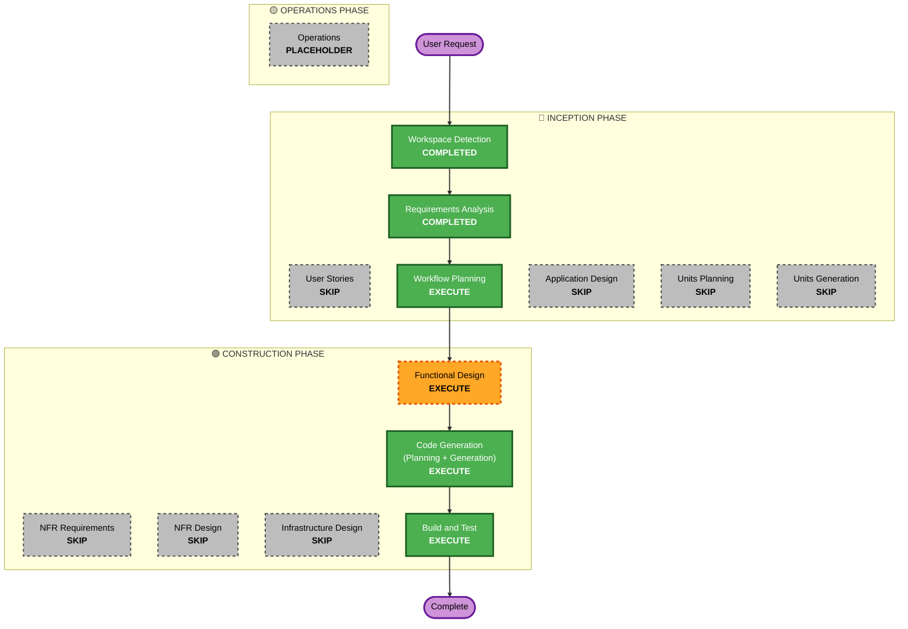

# 実行計画 (Execution Plan)

## 詳細分析の概要

### 変更の影響評価 (Change Impact Assessment)
- **ユーザー向け変更**: いいえ (バックグラウンドエージェントのため)
- **構造的な変更**: はい (新規コンポーネントの構築)
- **データモデルの変更**: はい (AWS IoT Coreへ送信するための新規JSONスキーマ)
- **APIの変更**: はい (MQTTトピックおよびペイロード定義)
- **非機能要件(NFR)の影響**: はい (リソース消費の最小化、オフラインキューイング)

### リスク評価 (Risk Assessment)
- **リスクレベル**: Low (独立したクライアントエージェントのため、システム全体への影響は少ない)
- **ロールバックの複雑さ**: Easy (ローカルでの停止やアンインストールで対応可能)
- **テストの複雑さ**: Moderate (OS固有のAPIフックおよびMQTT通信のモックが必要)

## ワークフローの視覚化 (Workflow Visualization)

### Mermaid Diagram

### Text Alternative
Phase 1: INCEPTION
- Workspace Detection (COMPLETED)
- Requirements Analysis (COMPLETED)
- User Stories (SKIP)
- Workflow Planning (EXECUTE)
- Application Design (SKIP)
- Units Planning (SKIP)
- Units Generation (SKIP)

Phase 2: CONSTRUCTION
- Functional Design (EXECUTE)
- NFR Requirements (SKIP)
- NFR Design (SKIP)
- Infrastructure Design (SKIP)
- Code Generation (EXECUTE)
- Build and Test (EXECUTE)

## 実行予定のフェーズ (Phases to Execute)

### 🔵 INCEPTION PHASE
- [x] Workspace Detection (COMPLETED)
- [x] Reverse Engineering (SKIPPED)
- [x] Requirements Analysis (COMPLETED)
- [x] User Stories (SKIPPED)
  - **Rationale**: 内部バックグラウンドツールであり、ユーザーインターフェースを持たないため。
- [x] Execution Plan (IN PROGRESS)
- [ ] Application Design - **SKIP**
  - **Rationale**: 単一コンポーネントであり、複雑なサービス間通信がないため。
- [ ] Units Planning - **SKIP**
  - **Rationale**: 複数のユニットに分割する必要がない小規模なコンポーネントのため。
- [ ] Units Generation - **SKIP**
  - **Rationale**: Units Planningをスキップするため。

### 🟢 CONSTRUCTION PHASE
- [ ] Functional Design - **EXECUTE**
  - **Rationale**: OS APIフックのロジック、データモデル（JSONスキーマ）、およびオフラインキューイングの状態管理を明確に設計する必要があるため。
- [ ] NFR Requirements - **SKIP**
  - **Rationale**: 必要な非機能要件（リソース最小化等）は要件定義でカバーされており、追加の要件評価は不要なため。
- [ ] NFR Design - **SKIP**
  - **Rationale**: 同上。
- [ ] Infrastructure Design - **SKIP**
  - **Rationale**: ローカルPC上で動作するクライアントツールであり、新たなクラウドリソースの定義が不要なため。
- [ ] Code Generation - **EXECUTE** (ALWAYS)
  - **Rationale**: 実装およびテストコードの生成が必要なため。
- [ ] Build and Test - **EXECUTE** (ALWAYS)
  - **Rationale**: ビルドおよびテストの指示が必要なため。

### 🟡 OPERATIONS PHASE
- [ ] Operations - PLACEHOLDER
  - **Rationale**: 将来のデプロイおよび監視ワークフローのため。

## 予想タイムライン (Estimated Timeline)
- **Total Phases**: 3 (Functional Design, Code Generation, Build and Test)
- **Estimated Duration**: 短期 (数時間〜1日程度)

## 成功基準 (Success Criteria)
- **Primary Goal**: OSレベルのアクティビティを監視し、AWS IoT Coreへ安定して送信できるエージェントを構築する。
- **Key Deliverables**: Pythonスクリプト、依存関係定義、MQTT証明書の設定手順、テストスイート。
- **Quality Gates**: プロパティベーステスト(PBT)による状態・データ変換の検証、およびオフラインキューからの復旧テスト。
