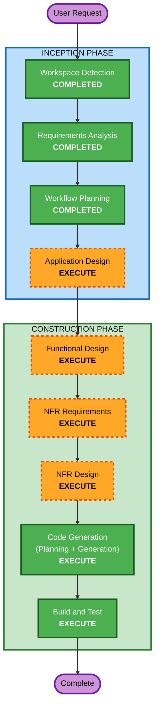

# Execution Plan — ss-tool (Screenshot Logger)

## Detailed Analysis Summary

### Change Impact Assessment
- **User-facing changes**: No — Windowsサービスとしてバックグラウンド動作（GUIなし）
- **Structural changes**: Yes — 新規プロジェクトの全体構造設計が必要
- **Data model changes**: Yes — メタデータJSONスキーマ、設定ファイルスキーマ、オフラインキュー構造
- **API changes**: No — 外部APIは提供しない（AWS IoT Core/S3のクライアントとして動作）
- **NFR impact**: Yes — バックグラウンド常駐、低リソース消費、信頼性（自動再起動、キュー永続化）

### Risk Assessment
- **Risk Level**: Medium
- **Rollback Complexity**: Easy（新規プロジェクトのため）
- **Testing Complexity**: Moderate（AWS接続のモック必要、Windowsサービス動作確認）

## Workflow Visualization



### Text Alternative
```
Phase 1: INCEPTION
  - Workspace Detection (COMPLETED)
  - Reverse Engineering (SKIP - Greenfield)
  - Requirements Analysis (COMPLETED)
  - User Stories (SKIP)
  - Workflow Planning (COMPLETED)
  - Application Design (EXECUTE)
  - Units Generation (SKIP - single tool)

Phase 2: CONSTRUCTION (single unit: ss-tool)
  - Functional Design (EXECUTE)
  - NFR Requirements (EXECUTE)
  - NFR Design (EXECUTE)
  - Infrastructure Design (SKIP - client-side only)
  - Code Generation (EXECUTE - ALWAYS)
  - Build and Test (EXECUTE - ALWAYS)

Phase 3: OPERATIONS
  - Operations (PLACEHOLDER)
```

## Phases to Execute

### 🔵 INCEPTION PHASE
- [x] Workspace Detection (COMPLETED)
- [x] Reverse Engineering - SKIP (Greenfield)
- [x] Requirements Analysis (COMPLETED)
- [x] User Stories - SKIP (単一ユーザー向けバックグラウンドサービス、ユーザーインタラクション無し)
- [x] Workflow Planning (IN PROGRESS)
- [ ] Application Design - **EXECUTE**
  - **Rationale**: 新規コンポーネント（SS撮影、S3アップローダー、MQTT送信、オフラインキュー、設定管理、Windowsサービス）の識別とサービスレイヤー設計が必要。S3認証方式の設計も含む。
- [ ] Units Generation - SKIP
  - **Rationale**: 単一ツール（ss-tool）のため、さらなるユニット分割は不要。

### 🟢 CONSTRUCTION PHASE (Single Unit: ss-tool)
- [ ] Functional Design - **EXECUTE**
  - **Rationale**: 撮影ロジック（定期+イベント駆動+デバウンス）、オフラインキュー管理、ストレージ管理のビジネスロジック詳細設計が必要。
- [ ] NFR Requirements - **EXECUTE**
  - **Rationale**: バックグラウンド常駐に伴うパフォーマンス要件、リソース管理、信頼性（自動再起動、キュー永続化）の非機能要件の整理が必要。
- [ ] NFR Design - **EXECUTE**
  - **Rationale**: NFR Requirementsに基づくパターン設計（ウォッチドッグ、永続キュー、リソースモニタリング等）が必要。
- [ ] Infrastructure Design - SKIP
  - **Rationale**: 本ツールはクライアントサイドのみ。AWS側インフラ（IoT Core, S3, IAMポリシー等）はdata-accumulation子AI-DLCの責務。
- [ ] Code Generation - **EXECUTE** (ALWAYS)
  - **Rationale**: Python Windowsサービスの実装コード生成が必要。
- [ ] Build and Test - **EXECUTE** (ALWAYS)
  - **Rationale**: ビルド手順、テスト手順の作成が必要。

### 🟡 OPERATIONS PHASE
- [ ] Operations - PLACEHOLDER

## Estimated Timeline
- **Total Stages to Execute**: 7 (Application Design + Functional Design + NFR Requirements + NFR Design + Code Generation + Build and Test + Workflow Planning)
- **Estimated Interactions**: 10-15（各ステージの実行と承認を含む）

## Success Criteria
- **Primary Goal**: Windowsサービスとして動作し、アクティブウィンドウのSSを定期的・イベント駆動的にキャプチャしてAWS (S3 + IoT Core) へ送信するツールの完成
- **Key Deliverables**:
  - Python Windowsサービス実行可能コード
  - 設定ファイルテンプレート
  - オフラインキュー永続化機構
  - 単体テスト（PBT Partial: 純粋関数+シリアライゼーション往復）
- **Quality Gates**:
  - Windowsサービスとしての正常起動・停止
  - SS撮影（定期+ウィンドウ切替）の動作確認
  - オフライン→オンライン復旧時のキュー再送信
  - 設定ファイルによるパラメータ制御
